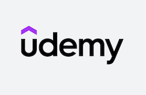

# Reboot of FHLBC Code Warriors 

## Group of bank employees learing to code and discuss programming topics



### Description: *The purpose of this project is to learn, practice, and discuss Python programming concepts.*

---
#### Pre-Requisites

1. **An IDE or code text editor**
   - I really like [Jetbrains](https://www.jetbrains.com/) products and use the IntelliJ 
     editor, but it is not free.
   - Alternatives are [Sublime Text](https://www.sublimetext.com/) or [VS Studio Code](https://code.visualstudio).
2. **Install Python ~3.9 from a Terminal**
    - Typically `pip install python` will install the most recent stable version.
    - For Mac users, it may be easier if you also have [Homebrew](https://brew.sh/), then run `brew install python`
3. **GitHub account**
    - This is a place for you to store your code in the cloud.
    - Best practice is to establish MFA after account creation [here](https://github.com/).
4. **Udemy Python Bootcamp Course** *Optional*
    - We will be referencing exercises from [this course](https://fhlbc.udemy.com/course/the-modern-python3-bootcamp/learn/lecture/8658338#overview) so less experienced members of our group can also learn how 
      to code using Python.
5. **CodeWars Account** *Optional*
    - We will occasionally pause from the coursework to reference some coding challenges in [CodeWars](https://www.codewars.com/).
    - Link to your GitHub for best reach and visibility
    - The bank has a 'Clan' you can join by entering `FHLBC` in your [account settings](https://www.codewars.com/users/edit).


```python
# Example from an exercise
def repeat_str(repeat, string):
    return string * repeat
```
#### Motivation Ideas
- [ ] Join a coding challenge through social media like `#100DaysOfCode`
- [ ] Explore local groups or meetups like [WomenWhoCode](https://www.womenwhocode.com/chicago) or [Chicago Python 
  Meetup](https://www.meetup.com/_chipy_/)
- [ ] Join [Discord](https://www.makeuseof.com/discord-servers-for-web-developers/) or [Slack](https://chicago-tech.slack.com/) coding groups
- [ ] Start a conversation in our **FHLBC** *Code Warriors* MS. Teams channel

#### Time to build something!


